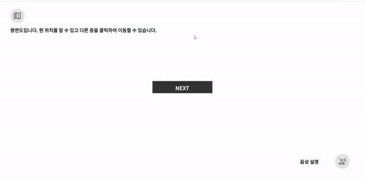
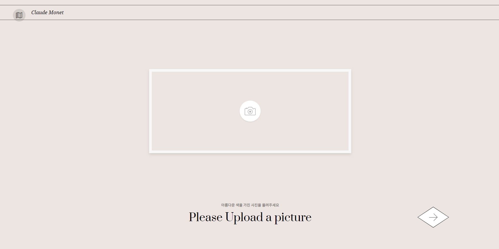
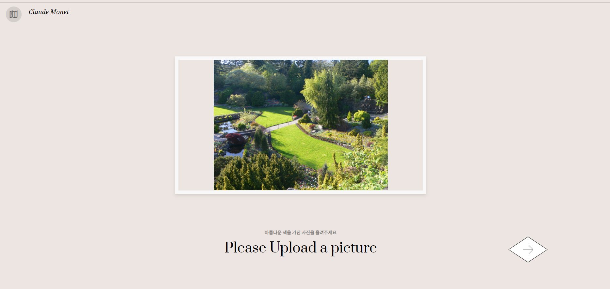
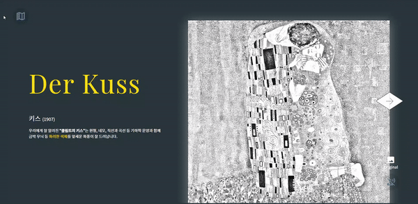
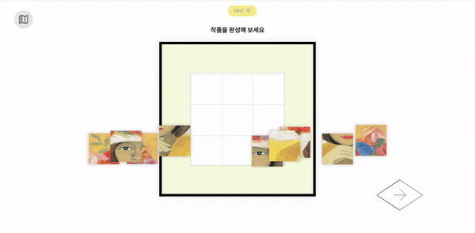
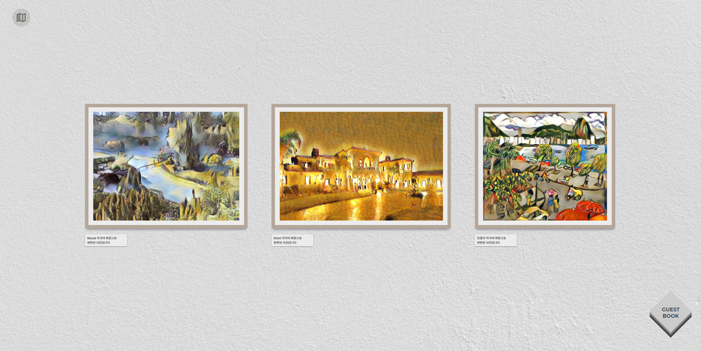
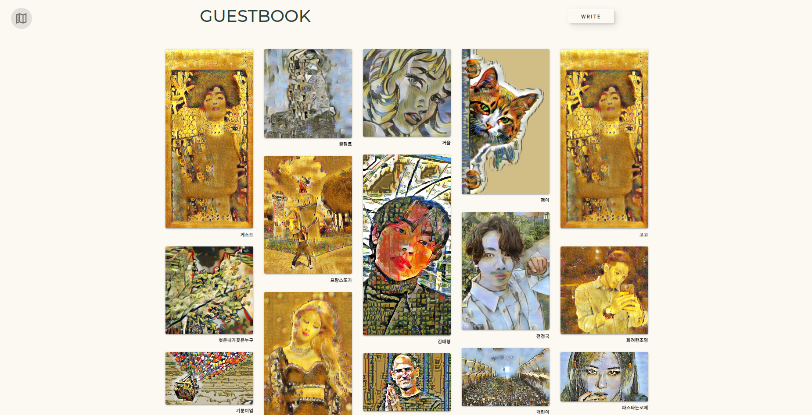
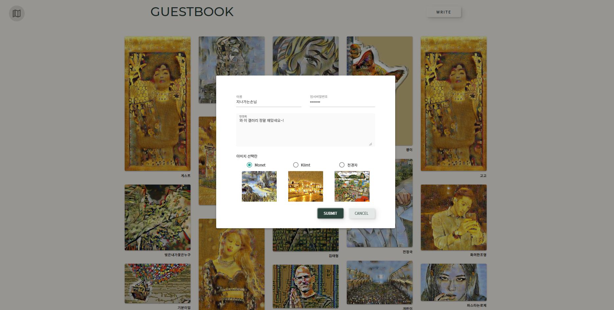

# 그림이 널 만났을 때

> 온라인 인터랙티브 미술관

## 📙'그림이 널 만났을 때' 소개

- 개발기간 : 2021.03.02 ~ 2021.04.09

- 웹사이트 : 그림이 널 만났을 때 (GNM)

  - 문제 : 
    - 코로나로 인해서 문화 예술 관람률이 저하되었다.
    - 국민의 81%는 문화생화을 `영화`만 즐기는 것 문화 편식현상이 심각하다.
  - 원인 : 
    - 미술에 대한 지식이 없어서 미술관을 찾는 것이 어렵다.
    - 집, 학교, 직장 근처에 미술관이나 갤러리가 없어서 찾지 않게 된다.

  - 해결방안 : 
    - 미술을 잘 모르는 사람도, 근처에 미술관이 없어도 다양한 문화예술을 즐길 수 있도록 온라인 인터랙티브 미술관을 기획하게 되었다.

- 팀원 소개 : 

  - 김규연  : Frontend
  - 김다민 : Backend
  - 박다솔 : Backend, Frontend
  - 최규수 : 팀장, Frontend & AI
  - 황승주 : Frontend & AI

## 🔧Tech Stack

    

## 💻페이지소개

### Main Page

> 메인페이지에서는 전시관 보러가기 버튼과 전시 작가의 간략한 소개가 있다.

### Tutorial Page

> 튜토리얼 페이지에서는 층별안내도와, 음성설명 버튼 사용에 대한 설명을 간략하게제공한다.
>
> 각 층 버튼을 누르면 각 층이 어떤 페이지로 연결되는지 알려주고 층으로 이동하는 버튼을 제공한다.
>
> `NEXT` 버튼을 누르면 층별로 이동하지 않고 `그림이 널 만났을 때`가 제공하는 순서로 관람을 시작할 수 있다.

### 작가 소개 페이지
> 작가소개 페이지에서는 입장하는 전시관의 작가에 대한 간략한 소개를 사진과 음성으로 제공한다.

#### 모네 

<video src="../특화gif/monetintro.mp4"></video>

#### 클림트

<video src="../특화gif/klimtintro.mp4"></video>

#### 천경자

<video src="../특화gif/cheonintro.mp4"></video>

### Upload Page

> 각 전시관 입구에서 사진을 업로드 하는 페이지로 시작한다.
>
> 각 전시관의 특징에 맞는 사진을 업로드 하라는 안내 문구가 제공된다.

### 인터랙티브 갤러리

#### 모네 인터랙티브 작품

> 모네의 수련이라는 작품은 연못을 그린 작품으로 연못의 느낌을 관람자가 직접 느낄 수 있도록 마우스의 이동에 따라 파동이 생기는 인터랙티브 작품으로 구현했다.

#### 클림트 인터랙티브 작품

> 클림트는 화려한 화풍으로 유명해 작가의 다양한 색채를 집중해서 즐길 수 있도록 마우스의 이동에 따라 그림의 화려함을 느낄 수 있는 인터랙티브 요소가 첨가되었다.
>
> 마우스를 계속 클릭하면 원본을 볼 수 있는 범위가 커지고, 원본을 그대로 즐기고 싶다면 `original` 버튼을 눌러 감상 할 수 있다.

#### 천경자 인터랙티브 작품

> 천경자의 인터랙티브 작품은 퍼즐을 맞추며 감상할 수 있도록 구현하였다.
>
> `HINT` 버튼을 통해 원본을 감상 후 퍼즐을 맞출 수도 있다.

### 일반 갤러리

> 일반 갤러리에서는 작가의 대표작품, 작품설명, 음성설명이 제공된다.

<video src="../특화gif/monet.mp4"></video>

<video src="../../../Videos/Captures/그림이 널 만났을 때 - Chrome 2021-06-20 19-55-55.mp4"></video>

<video src="../특화gif/klimt.mp4"></video>

### 특별전시관

> 특별전시관에서는 각 전시관 입장 시 업로드 했던 사진을 각 작가의 화풍으로 변환 한 것을 제공한다.

### 방명록

> 특별전시관에서 각 작가의 화풍으로 변환된 나의 사진을 방명록에 작성하여 자랑할 수 있다.

## 💎주요기능

### 인터랙티브 작품

> 다양한 방법으로 작품을 즐기면서 눈으로만 즐기던 미술관과의 차별화

- 전시관 별로 인터랙티브 요소가 추가된 작품을 제공하여 작품의 의미를 더 잘 느끼고, 기억할 수 있도록 함

- 문자설명과 음성설명을 제공해 미술을 잘 모르는 사람도 작품을 즐길 수 있도록 돕는 기능

### 특별전시관

> 작가의 화풍으로 변환된 이미지를 통해 작가의 특징을 더 잘 기억하도록 돕는 기능

- 각 전시관 입장시 작가의 특성에 맞는 사진을 관람자가 업로드하면서 작가의 특성을 다시 한번 새길 수 있다.
- 특별전시관에서 작가의 화풍으로 변환 된 나의 사진을 관람하면서 `나의 추억으로 가득찬 갤러리`를 감상할 수 있다.
- 작가의 화풍으로 변환된 사진을 **다운로드** 하거나 **방명록**에 게시 해 다른 사람들과 공유 가능
- 각 작가의 화풍을 비교하면서 작가에 대해서 더 잘 이해 할 수 있다.

### 방명록

- 작가의 화풍으로 변환된 나의 사진과 함께 방명록을 등록, 수정, 삭제 가능
- 다른 사람들의 변환 된 사진 감상 가능

